# VGAX Library for Arduino UNO and MEGA

COPYRIGHT (C) 2014 Sandro Maffiodo  
[smaffer@gmail.com](mailto:smaffer@gmail.com)  
[http://www.sandromaffiodo.com](http://www.sandromaffiodo.com)

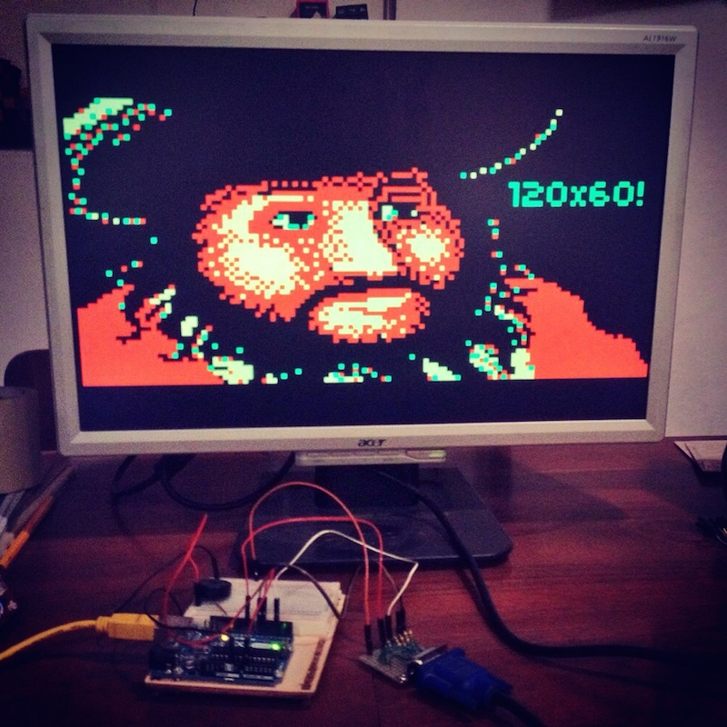

YouTube videos:

Some photos:

[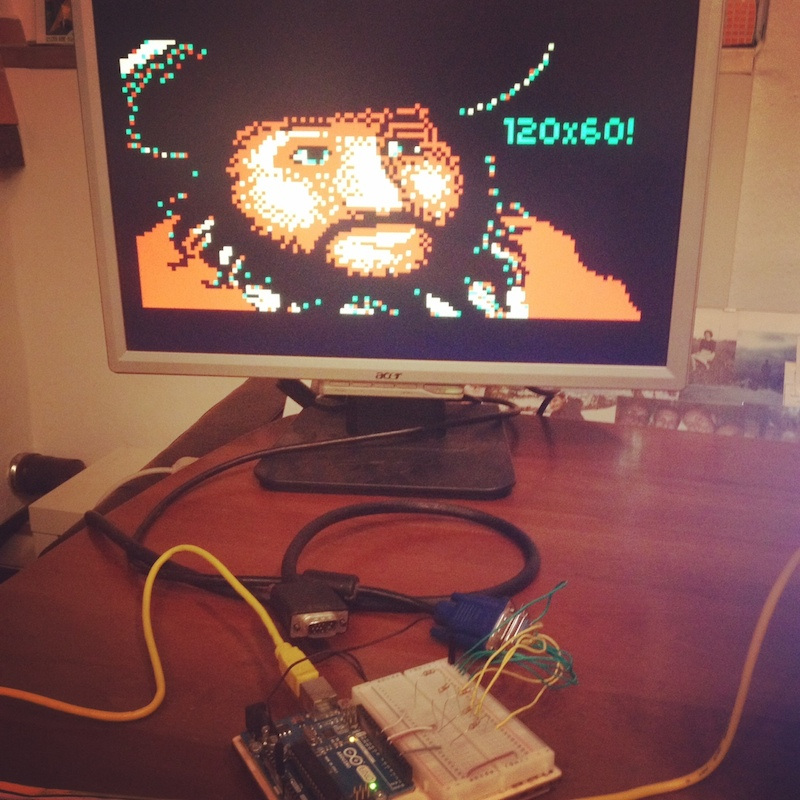](docs/screenshot1.jpg)
[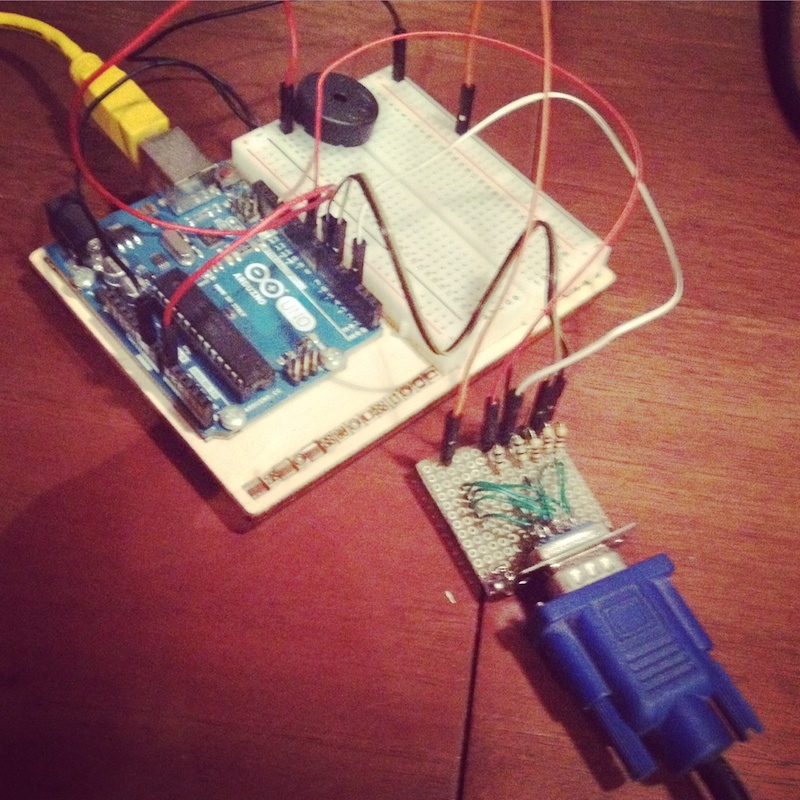](docs/screenshot5.jpg)
[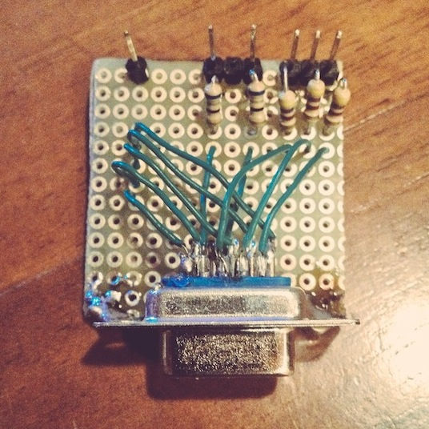](docs/screenshot2.jpg)
[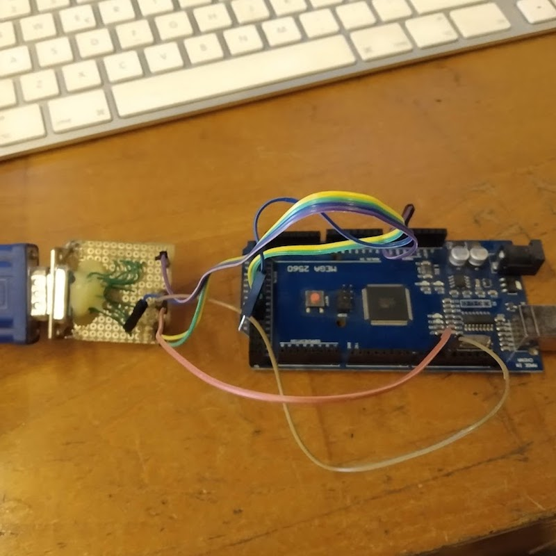](docs/screenshot6.jpg)

## What is VGAX?

This is a VGA library for Arduino UNO and Arduino MEGA.  
To use this library you need only 4 resistors and one DSUB15 connector.  
This library require an ATMega328 MCU (or higher) MCU. Does not work with ATTINY family or ATMega168.

## Credits

Based on the [VGA color video generation](http://www.gammon.com.au/forum/?id=11608) by [Nick Gammon](http://www.gammon.com.au).  
Inspired from the game [Toorums Quest](http://petenpaja.blogspot.fi/2013/11/toorums-quest-ii-retro-video-game.html) by [Peten Paja](http://petenpaja.blogspot.fi).  
AVR [interrupt dejitter](https://github.com/cnlohr/avrcraft/tree/master/terminal) from [Charles CNLOHR](https://github.com/cnlohr).  
Thanks to Roberto Melzi [RobCai](https://www.youtube.com/channel/UCgQK0QAMUV5L4OT6y7HsryQ) for developing the first game that uses this library: [Arduino Bomber](https://www.youtube.com/watch?v=dtfNhh6GZ-s). 

Check out my others Arduino libraries: 

- [ESPVGAX](https://github.com/smaffer/espvgax) a VGA library for ESP8266 that support 512x480px 1bpp framebuffer
- [VGAXUA](https://github.com/smaffer/vgaxua) a VGAX variant that support 192x80px 1bpp or 200x240px 1bpp on Arduino MEGA!

## Video

The library implement a 120x60px framebuffer where each pixel is stored as 2 bits (4 colors). On Arduino MEGA resolution can be increased to 120x240px.
The framebuffer is stored inside SRAM and require at least 1800 bytes. This mean that on ATMega328 your programs cannot use more than 200 bytes so be carefull! If you want, you can use another Arduino UNO to drive the one that use VGAX library. On ATMega2560 you have more SRAM but if you expand the framebuffer to 120x240px free SRAM will be 800 bytes.

VGAX framebuffer use 2bit for each pixel. Inside each byte are stored 4 pixels, packed in this order: leftmost pixel is in the highest 2bits, rightmost pixel is  on the lowest 2bits:

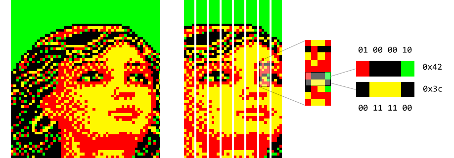

On Arduino MEGA (ATMega2560) framebuffer can be extended to 120x90px with squared pixels or 120x240px with rectangular pixels. You can enable these alternatives resolutions by uncommenting these constants on VGAX.h header:

	//uncomment ATMEGA2560_HIGHRES to use 120x90px squared pixels
	//#define ATMEGA2560_HIGHRES 
	
	//uncomment ATMEGA2560_MAXRES to use 120x240px rectangular pixels
	//#define ATMEGA2560_MAXRES

## Audio

This library implement an async tone (audio) generation too! The audio signal is
generated in around 15 cycles of clock, inside the VGA horizontal back porch. The quality of the signal is poor but can be used to play some melodies.
You can use tone(frequency) and noTone() methods to control the note duration.
Your buzzer **must** be connected on the A0 pin.

## Wiring

You need:

- 2x 470ohm resistors
- 2x 68ohm resistors 
- 1x DSUB15 female connector

Then connect them like the following schema.  
*NOTE: The DSUB15 connector is shown from rear view*

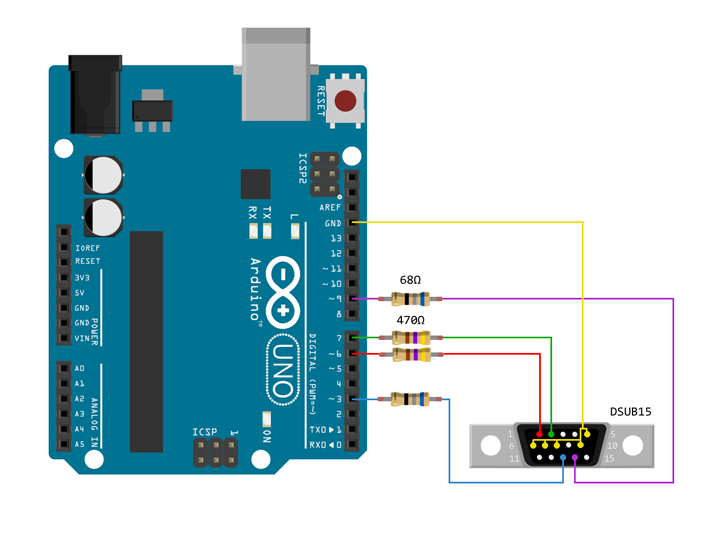
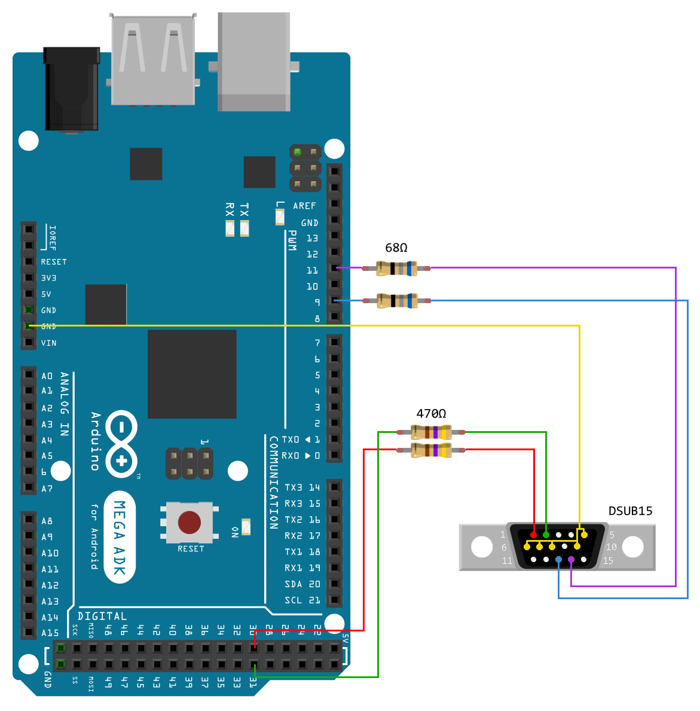

### 4 Colors
The 4 colors generated from the library are not predefined.  
On Arduino UNO you can connect the pin 6 and pin 7 with two of the VGA DSUB15 RGB pins, selecting the color combination that you prefer.

These are some of the possible combinations, done without additional components:

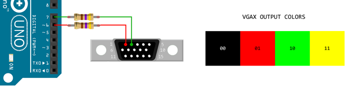

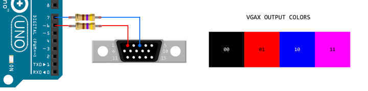

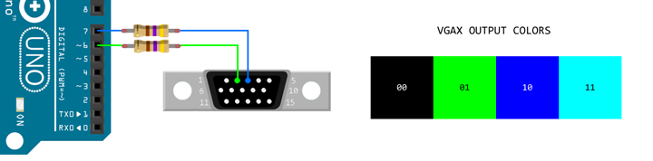

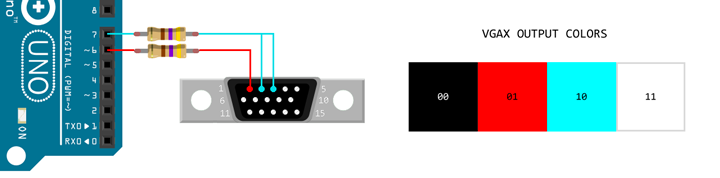

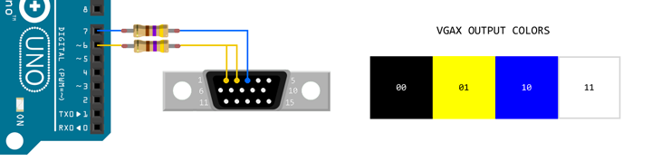

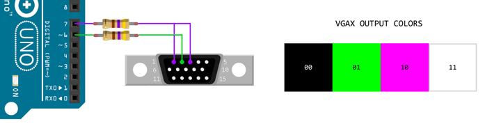

Pin 6 and pin 7 on Arduino MEGA must be changed to pin 30 and pin 31 but the same logic of choosing colors can be applyed on MEGA.

## PIN and PORT

Video generation is implemented using PORTD, so **you cannot use any of the
PORTD pins**.

The vertical synchronization signal is generated on pin 9. Gammon's version use
the pin 10 but i prefer to keep pins 10 11 12 13 free for common SPI usage.

On Arduino MEGA PORTD is substituted to PORTA, vertical sync is pin 11 and horizontal pin is 9.

## Interrupt

VGAX library generate the video signal using only interrupts, so, inside main() function, you can do anything you want. Your code will be interrupted when VGA signal needs to be generated.

[Nick Gammon](http://www.gammon.com.au/forum/?id=11608)'s original code generate the line pixels inside main(). I prefer to generate the line inside interrupts to keep the MCU free to do some other things, like run games or play sounds.

**WARNING: You cannot add other interrupts or the VGA signal generation will be broken.**

## Timers

This library uses **all the 3 timers** of ATMega328 MCU. On ATMega2560 there are more unused timers.

*TIMER1* and *TIMER2* are configured to generate HSYNC and VSYNC pulses.
The setup code for these two timers has been [created by Nick Gammon](http://www.gammon.com.au/forum/?id=11608).
I have only made some modifications to use pin 9 instead of pin 10. On ATMega2560 HSYNC and VSYNC are different.

*TIMER0* is used to fix the interrupt jitter. I have modified an assembler trick
originally writen by [Charles CNLOHR](https://github.com/cnlohr/avrcraft/tree/master/terminal).

By default the *TIMER0* is used by Arduino to implement these functions:

	unsigned millis();
	unsigned long micros();
	void delay(ms); 
	void delayMicroseconds(us);

Instead of using these functions, you should use the alternative versions
provided by my library.

## Library usage

To use the VGAX library you need to include its header

    #include <VGAX.h>

VGAX class is static, so you can use the class without create an instance of it:

    void setup() {
      VGAX::begin();
    }

Or, if you prefer, you can create your instance, but keep in mind that cannot be
more than one VGAX instance at a time:

    VGAX vga;

    void setup() {
      vga.begin();
    }

### Pixel

This is a simple example of putpixel4 function. The putpixel4 function put 4
pixels at a time. The following code create a pattern of colors in the setup
function:

	 #include <VGAX.h>

    VGAX vga;

    void setup() {
      vga.begin();
      vga.clear(11);
      for (int y=0; y!=VGAX_HEIGHT; y++) {
        for (int x=0; x!=VGAX_BWIDTH; x++) {
          vga.putpixel4(x, y, y%2 ? 27 : 228);
        }
      }
    }
    void loop() {
    }
    
### Images

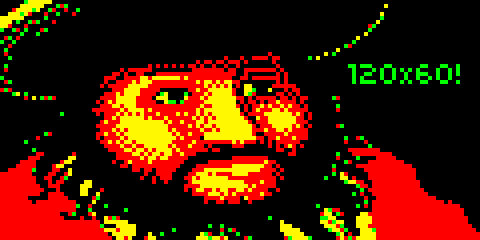

This example show the copy function. The copy function copy all pixels from 
an array of bytes. The array **must** be stored in PROGMEM and the size of the
array must be equal to the VGAX framebuffer:

    VGAX_BWIDTH * VGAX_HEIGHT
    (30 * 60)

Note that the size in bytes is calculated using BWIDTH instead of WIDTH, because
pixels are packed into bytes (4 pixels in one byte).

	  #include <VGAX.h>

	  //image generated from 2BITIMAGE - by Sandro Maffiodo
    #define IMG_PIRATE_BWIDTH 30
    #define IMG_PIRATE_HEIGHT 60
    //data size=900 bytes
    const unsigned char img_pirate_data[IMG_PIRATE_HEIGHT*IMG_PIRATE_BWIDTH] PROGMEM={
        0,  7,255,192,  0,  0,  0,  0,  0,  0,  0,  0,  0,  0,  0,  0,  0,  0,  0,  0,  0,  0,  0,  0,  0,  0,  0,  0,  0,  0,
        0, 63,252,  6, 64,  0,  0,  0,  0,  0,  0,  0,  0,  0,  0,  0,  0,  0,  0,  0,  0,  0,  0,  0,192,  0,  0,  0,  0,  0,
        2,255,112, 96,129,  0,  0,  0,  0,  0,  0,  0,  0,  0,  0,  0,  0,  0,  0,  0,  0,  0,  0,  0,  0,  0,  0,  0,  0,  0,
       15,222,  2,  4,  8,  0,  0,  0,  0,  0,  0,  0,  0,  0,  0,  0,  0,  0,  0,  0,  0,  0,  0,  3,  0,  0,  0,  0,  0,  0,
      255,240,  1,  0,  0,  0,  0,  0,  0,  0,  0,  0,  0,  0,  0,  0,  0,  0,  0,  0,  0,  0,  0,  1,  0,  0,  0,  0,  0,  0,
      252, 65,144, 32,  0,  0,  0,  0,  0,  0,  0,  0,  0,  0,  0,  0,  0,  0,  0,  0,  0,  0,  0, 12,  0,  0,  0,  0,  0,  0,
      248,  8,  0,  0,  0,  0,  0,  0,  0,  0,  0,  0,  0,  0,  0,  0,  0,  0,  0,  0,  0,  0,  0,144,  0,  0,  0,  0,  0,  0,
       65,132,  9,  0,  0,  0,  0,  0,  0,  0,  0,  0,  0,  0,  0,  0,  0,  0,  0,  0,  0,  0,  0, 64,  0,  0,  0,  0,  0,  0,
        0, 16, 16,  0,  0,  0,  0,  0,  0,  0,  0,  0,  0,  0,  0,  0,  0,  0,  0,  0,  0,  0,  3,  0,  0,  0,  0,  0,  0,  0,
       36,128,  0,  0,  0,  0,  0,  0,  0,  0,  0,  0,  0,  0,  0,  0,  0,  0,  0,  0,  0,  0, 48,  0,  0,  0,  0,  0,  0,  0,
       65,  0,  0,  0,  0,  0,  0,  0,  0,  0,  0,  0,  0,  0,  0,  0,  0,  0,  0,  0,  0,  0, 64,  0,  0,  0,  0,  0,  0,  0,
        8,  0,  0,  0,  0,  0,  0,  0,  0,  0,  0,  0,  0,  0,  0,  0,  0,  0,  0,  0,  0,  6,  0,  0,  0,  0,  0,  0,  0,  0,
       16,  0,  0,  0,  0,  0,  0,  0,  0,  0,  0,  0,  0,  0,  0,  0,  0,  0,  0,  0,  0,192,  0,  0,  0,  0,  0,  0,  0,  0,
       32,  0,  0,  0,  0,  0,  0,  0,  0,  0,  0,  0,  0,  0,  0,  0,  2,  0,  0,  0, 49,  0,  0,  0,  0,  0,  0,  0,  0,  0,
        4,  0,  0,  0,  0,  0,  0,  0,  0,  0,  0,  0,  0,  0,128,130,168,160,  0, 19,  0,  0,  0,  0,  0,  0,  0,  0,  0,  0,
        0,  0,  0,  0,  0,  0,  0,  0,  0,  0,  0,  0, 34,138, 42, 32,  0,128,  0,  0,  0,  0,  0,  0,  0,  0,  0,  0,  0,  0,
       16,  0,  0,  0,  0,  0,  0,  0,  0, 34, 34, 34,136, 32,130,  0,  0, 32,  0,  0,  0,  1, 69, 64, 80,  0, 20,  5,  4,  0,
       32,  0,  0,  0,  0,  0,  0,  8,170,160,  0,  0,170,170, 40, 42,170,136,  0,  0,  0,  0, 64, 17,  4, 68, 64, 16, 68,  0,
        0,  0,  0,  0,  0,  0,  0,162, 10,  2,170,170,170,170,168, 32,  0, 34,  0,  0,  0,  0, 65, 65,  4, 16, 84, 16, 68,  0,
       64,  0,  0,  0,  0,  0, 10,130,171,239,255,238,170,170,160,162,170,162,  0,  0,  0,  0, 68,  1,  4, 16, 65, 16, 64,  0,
       36,  0,  0,  0,  0,  0,  8, 42,187,250,170,170,187,238,250,  0,  0, 34,  0,  0,  0,  0, 69, 80, 80, 68, 20,  5,  4,  0,
        0,  0,  0,  0,  0,  0, 34,170,255,234,170,170,171,187,178, 60,  0,170,160,  0,  0,  0,  0,  0,  0,  0,  0,  0,  0,  0,
      152,  0,  0,  0,  0,  0,  0,171,254,170,  0,  2,186,255,248, 61,  3,  2, 40,  0,  0,  0,  0,  0,  0,  0,  0,  0,  0,  0,
        1,196,  0,  0,  0,  0, 10,187,254,168,112,  4,171,191,248, 54,  0, 40,136,  0,  0,  0,  0,  0,  0,  0,  0,  0,  0,  0,
        0,  8,198, 96,  0,  0, 42,191,250,163,240, 14,174,255,254,136,170,138, 34,128,  1,128,  0,  0,  0,  0,  0,  0,  0,  0,
        0,  0,  0,  0,  0,  0,139,191,250,168, 53, 26,171,255,252,138, 34,186,162,  0,  0,  0,  0,  0,  0,  0,  0,  0,  0,  0,
        0,  0,  0,  0,  0,  0, 42,251,250,170,170,170,174,191,254, 34,187,174,232,128,  0, 64,  0,  0,  0,  0,  0,  0,  0,  0,
        0,  0,  0,  0,  0,  2,170,174,255,186,170,170,187,255,255, 34,234,251,170,128,  0,128,  0,  0,  0,  0,  0,  0,  0,  0,
        0,  0,  0,  1,  0,  0,138,187,187,171,170,238,187,191,255,138,175,255,238, 32,  0,  0,  0,  0,  0,  0,  0,  0,  0,  0,
        0,  0,  0,  0,  0,  0, 10,239,255,186,186,170,238,239,255,224,235,255,250, 32,  0,  0,  0,  0,  0,  0,  0,  0,  0,  0,
        0,  0,  0,  0,  0,  0, 46,175,255,255,238,186,190,255,255,248,171,255,250,128,  0,  0,  0,  0,  0,  0,  0,  0,  0,  0,
        0,  0,  0,  0,  0,  0,170,191,255,255,250,171,187,239,255,254, 42,255,238, 32,  0,144,  0,  0,  0,  0,  0,  0,  0,  0,
        0,  0,  0,  0,  0,  0, 42,238,255,255,251,170,174,187,255,254,174,190,234,128,  0,  0,  0,  0,  0,  0,  0,  0,  0,  0,
        0,  0,  1,128,  0,  0,174,187,255,255,254,235,171,255,255,254, 10,171,170,128,  0,  0,  0,  0,  0,  0,  0,  0,  0,  0,
        0,  0, 32,  0,  0,  0,138,174,255,255,255,186,163,255,255,255,162,186,186,128,  0,  4, 36,  0,  0,  0,  0,  0,  0,  0,
        0,  4,  0,  0,  0,  0, 43,187,239,255,254,170,234,170,174,234, 34, 42,168,  0,  0,  8,  2,  0,  0,  0,  0,  0,  0,  0,
        0,  0,  0,  0,  0,  0, 10,174,186,255,251,171,168,128, 10,128,  2, 34,226,  0,  0,  0,  0, 64,  0,  0,  0,  0,  0,  0,
        0,  0, 64,  0,  0,  0,  2,171,239,187,254,234,170, 40,  0,  0,  0, 40, 32,  0,  0,  2,170,168,  0,  0,  0,  0,  0,  0,
        0,  0, 40,  0,  8,  0,  0, 42,190,239,190,186,128,  0,  0,  0,  0,  0,160,  0,  0, 64,170,170,160,  0,  0,  0,  0,  0,
        0,  2,160,  0, 60,  0,  0, 42,171,190,250,168,  0,  0, 10,170,168,  0,  0,  0,  0,128, 16, 10,168,  0,  0,  0,  0,  0,
        0, 42,128,  2,240,  0,  0,130,234,186,170,160,  0,170,170,170,174,128,  0,  0,  0,  6,  0,170,170,128,  0,  0,  0,  0,
        0,170,128, 47,  0,  0,  0, 10, 42,170,170,128, 42,170,175,255,250, 32,  0,  0,  1,  0, 42,170,170,168,  0,  0,  0,  0,
       10,170, 64, 40, 48,  0,  0,  0, 40,162,170,  0,171,255,255,255,234,136,  0,  0,  2,  0,  2,170,170,170,  0,  0,  0,  0,
      170,170,  0,160,176,  0,  0,  0,  0,130,168,  2,191,186,175,250,170, 32,  0,  0,  1, 56,  0,170,170,170,  0,  0,  0,  0,
      170,170,130,130, 64,  0,  0,  0,  2,  8,168, 10,239,255,234,170,170,136,  0,  0, 16, 60,128,170,170,170,  0,  0,  0,  0,
      170,170,128,138,  0, 60,  0,  0,  0,  8, 32,  2,255,255,255,234,186,128,  0,  0,  0,  7,232, 42,170,170,128,  0,  0,  0,
      170,170,160,168,  0,252,  0,  0,  0,  0,  0, 10,175,255,255,251,170,128,  0,  0,  0,  0, 26, 42,170,170,128,  0,  0,  0,
      170,170,168,  8,  0,240, 32,  0,  0,  0,  0,  8,190,187,235,238,168, 32,  0,  0,  0,  0,  4,170,170,170,160,  0,  0,  0,
      170,170,160,170,  0,240,192,  0,  0,  0,  0,  0,170,254,238,170,186,  0,  0,  0,  0,  0, 72, 42,170,170,168,  0,  0,  0,
      170,168,  0,170,128,  2, 64,  0,  0,  0,  0,  0,  2,171,170, 58,160,  0,  0,  0,  0,  0,  2, 10,170,170,170,128,  0,  0,
      170,170, 42,170,168,  3,  0,  0,  0,  0,  0,  0,  2, 10, 42,  8,  0,  0,  0,  0,  0,  0,  1, 42,170,170,170,168,128,  0,
      170,170,170,170,169,  8,  4,  0,  0,  0,  0,  0,  0,  0,  0,  0,  0,  0,  0,  1,  0,  0, 18, 42,170,170,170,170,168,  0,
      170,170,170,170,168,  4,  0,  1,  0,  0,  0,  0,  0,  0,  0,  0,  0,  0,  0,  0, 54,128,  0, 42,170,170,170,170,170,  0,
      170,170,170,168, 36, 11,  0,  0,  0,  0,  0,  0,  0,  0,  0,  0,  0,  0,  0,  0,188, 96, 15,170,170,170,170,170,170,  0,
      170,170,170,170,  0,130, 14, 96,  0,  0,  0,  0,  0,  0,  0,  0,  1,  0,  0,  0, 95,  0, 63,234,170,170,170,170,170,128,
      170,170,170,170,170,170,143,255,  0,  0,  0,  0,  0,  0,  0,  0,  0, 12,  0,  0,249,240, 63,234,170,170,170,170,170,128,
      170,170,170,170,170,170,144, 63,240,  0,  0,  0,  0, 65,  0,  0,  0, 15,192,  0, 63,144, 63,170,170,170,170,170,170,160,
      170,170,170,170,170,170,175,239,240,  0,  1,  0,  0,  2, 24,  0,  0, 15,252,  0,  7,228, 15,218,170,170,170,170,170,168,
      170,170,170,170,170,170,168,255,240, 48, 64,  0, 13,129,  1,  0,  0,  3,255,  0,  0,114, 15,250,170,170,170,170,170,170,
      170,170,170,170,170,170,170, 62,192,188,  0,  0, 63,126,192, 36,  0,  2,127,208,  0,185,191,250,170,170,170,170,170,170,
    };
    VGAX vga;

    void setup() {
      vga.begin();
      vga.copy((byte*)img_pirate_data);
    }

### Sprites

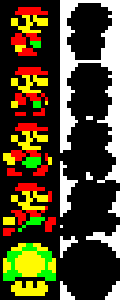

See [Example of a masked blit implementation](http://en.wikipedia.org/wiki/Bit_blit).

    #include <VGAX.h>

    //image generated from 2BITIMAGE - by Sandro Maffiodo
    #define IMG_MARIOMASK_WIDTH 16
    #define IMG_MARIOMASK_BWIDTH 4
    #define IMG_MARIOMASK_HEIGHT 16
    #define IMG_MARIOMASK_SPRITES_CNT 5
    //data size=512 bytes
    const unsigned char img_mariomask_data[IMG_MARIOMASK_SPRITES_CNT][IMG_MARIOMASK_HEIGHT][IMG_MARIOMASK_BWIDTH] PROGMEM={
    { { 255, 255, 255, 255, }, { 255, 192,   3, 255, }, { 255,   0,   0,  63, }, { 252,   0,   0,  15, }, { 252,   0,   0,  63, }, { 240,   0,   0,  15, }, { 240,   0,   0,  15, }, { 252,   0,   0,  63, }, { 255,   0,   0, 255, }, { 252,   0,   3, 255, }, { 240,   0,   0, 255, }, { 240,   0,   0, 255, }, { 252,   0,   0, 255, }, { 252,   0,   3, 255, }, { 255,   0,   3, 255, }, { 255,   0,   3, 255, }, },
    { { 255, 255, 255, 255, }, { 255, 192,   3, 255, }, { 255,   0,   0,  63, }, { 252,   0,   0,  15, }, { 252,   0,   0,  63, }, { 240,   0,   0,  15, }, { 240,   0,   0,  15, }, { 252,   0,   0,  63, }, { 255,   0,   0, 255, }, { 252,   0,   0,  63, }, { 252,   0,   0,  15, }, { 240,   0,   0,  15, }, { 240,   0,   0,  63, }, { 252,   0,   0,  63, }, { 252,   0,   0,  63, }, { 255,   3, 192, 255, }, },
    { { 255, 192,  15, 255, }, { 255,   0,   0,  63, }, { 252,   0,   0,  15, }, { 252,   0,   0,  63, }, { 240,   0,   0,  15, }, { 240,   0,   0,  15, }, { 252,   0,   0,  63, }, { 252,   0,   0, 255, }, { 192,   0,   0,  63, }, {   0,   0,   0,  15, }, {   0,   0,   0,   3, }, { 192,   0,   0,   3, }, { 240,   0,   0,  15, }, { 192,   0,   0,  15, }, { 192,   3,   0,  63, }, { 240,   3, 192, 255, }, },
    { { 255, 192,  15,   3, }, { 255,   0,   0,   0, }, { 252,   0,   0,   0, }, { 252,   0,   0,   3, }, { 240,   0,   0,   3, }, { 240,   0,   0,   3, }, { 252,   0,   0,  15, }, { 252,   0,   0,  15, }, { 240,   0,   0,  63, }, { 192,   0,   0,   3, }, {   0,   0,   0,   0, }, {   0,   0,   0,   0, }, { 192,   0,   0,   3, }, {   0,   0,   0,   3, }, {   0,   0,  63,  15, }, { 195,   3, 255, 255, }, },
    { { 255, 192,   3, 255, }, { 252,   0,   0,  63, }, { 240,   0,   0,  15, }, { 192,   0,   0,   3, }, { 192,   0,   0,   3, }, {   0,   0,   0,   0, }, {   0,   0,   0,   0, }, {   0,   0,   0,   0, }, {   0,   0,   0,   0, }, {   0,   0,   0,   0, }, {   0,   0,   0,   0, }, { 192,   0,   0,   3, }, { 240,   0,   0,  15, }, { 240,   0,   0,  15, }, { 252,   0,   0,  63, }, { 255,   0,   0, 255, }, },
    };
    //image generated from 2BITIMAGE - by Sandro Maffiodo
    #define IMG_MARIO_WIDTH 16
    #define IMG_MARIO_BWIDTH 4
    #define IMG_MARIO_HEIGHT 16
    #define IMG_MARIO_SPRITES_CNT 5
    //data size=1408 bytes
    const unsigned char img_mario_data[IMG_MARIO_SPRITES_CNT][IMG_MARIO_HEIGHT][IMG_MARIO_BWIDTH] PROGMEM={
    { {   0,   0,   0,   0, }, {   0,   0,   0,   0, }, {   0,  42, 168,   0, }, {   0, 170, 170, 128, }, {   0,  15,  48,   0, }, {   3, 195,  63, 192, }, {   3, 195, 207, 192, }, {   0,  63,   0,   0, }, {   0,  15, 252,   0, }, {   0, 162, 160,   0, }, {   2, 168, 168,   0, }, {   2, 168,  84,   0, }, {   0, 252,  20,   0, }, {   0, 250, 128,   0, }, {   0,  42, 160,   0, }, {   0,   0,   0,   0, }, },
    { {   0,   0,   0,   0, }, {   0,   0,   0,   0, }, {   0,  42, 168,   0, }, {   0, 170, 170, 128, }, {   0,  15,  48,   0, }, {   3, 195,  63, 192, }, {   3, 195, 207, 192, }, {   0,  63,   0,   0, }, {   0,  15, 252,   0, }, {   0, 162, 162,   0, }, {   0, 168, 168, 128, }, {   3, 232,  20, 192, }, {   3, 192,  20,   0, }, {   0,   0,   2,   0, }, {   0, 168,  42,   0, }, {   0,   0,   0,   0, }, },
    { {   0,   0,   0,   0, }, {   0,  42, 160,   0, }, {   0, 170, 170, 128, }, {   0,  15,  48,   0, }, {   3, 195,  63, 192, }, {   3, 195, 207, 192, }, {   0,  63,   0,   0, }, {   0,  15, 252,   0, }, {   2, 162, 160,   0, }, {  62, 168, 168, 128, }, {  63, 161,  84, 176, }, {  15,   5,  84,  48, }, {   0,   1,  82, 128, }, {  10,   0,  10, 128, }, {  10, 160,  42,   0, }, {   0,   0,   0,   0, }, },
    { {   0,   0,   0,   0, }, {   0,  42, 160,   0, }, {   0, 170, 170,   0, }, {   0,  15,  48,  32, }, {   3, 195,  63, 224, }, {   3, 195, 207, 224, }, {   0,  63,   0,   0, }, {   0,  15, 255, 128, }, {   2, 162, 162,   0, }, {   0, 168, 168,   0, }, {  63,  40,  85,  40, }, {  63,  33,  84, 168, }, {   0,   4,   0, 160, }, {  42,  16,   0, 160, }, {  40,   0,   0,   0, }, {   0,   0,   0,   0, }, },
    { {   0,   0,   0,   0, }, {   0,  61, 124,   0, }, {   3, 245,  95, 192, }, {   5,  95, 245,  80, }, {   5, 127, 253,  80, }, {  53, 255, 255,  92, }, {  61, 255, 255, 124, }, {  61, 255, 255, 124, }, {  53, 127, 253,  92, }, {  21,  95, 245,  84, }, {  21,   0,   0,  84, }, {   0, 243, 207,   0, }, {   3, 243, 207, 192, }, {   3, 255, 255, 192, }, {   0, 255, 255,   0, }, {   0,   0,   0,   0, }, },
    };
    VGAX vga;

    void setup() {
      vga.begin();
      vga.clear(11);
    }
    void loop() {
      static byte sidx=1;
      static unsigned cnt;
      vga.blitwmask((byte*)(img_mario_data[sidx]), (byte*)(img_mariomask_data[sidx]), IMG_MARIO_WIDTH, IMG_MARIO_HEIGHT, rand()%VGAX_WIDTH-IMG_MARIO_WIDTH/2, rand()%VGAX_HEIGHT-IMG_MARIO_HEIGHT/2);
      sidx=sidx==1 ? 2 : 1;
      if (cnt>=180) {
        cnt=0;
        vga.clear(3);
      }
    }

### Fonts

You can use my 2bitfont tool to create your fonts. I have designed two super small fonts that can be used with VGAX or with others projects. Here they are:

**ufont.png**: 

**ufont2.png**: 

The following example use the first font.

    #include <VGAX.h>

    //font generated from 2BITFONT - by Sandro Maffiodo
    #define FNT_UFONT_HEIGHT 6
    #define FNT_UFONT_SYMBOLS_COUNT 95
    //data size=570 bytes
    const unsigned char fnt_ufont_data[FNT_UFONT_SYMBOLS_COUNT][1+FNT_UFONT_HEIGHT] PROGMEM={
    { 1, 128, 128, 128,   0, 128,   0, }, //glyph '!' code=0
    { 3, 160, 160,   0,   0,   0,   0, }, //glyph '"' code=1
    { 5,  80, 248,  80, 248,  80,   0, }, //glyph '#' code=2
    { 5, 120, 160, 112,  40, 240,   0, }, //glyph '$' code=3
    { 5, 136,  16,  32,  64, 136,   0, }, //glyph '%' code=4
    { 5,  96, 144, 104, 144, 104,   0, }, //glyph '&' code=5
    { 2, 128,  64,   0,   0,   0,   0, }, //glyph ''' code=6
    { 2,  64, 128, 128, 128,  64,   0, }, //glyph '(' code=7
    { 2, 128,  64,  64,  64, 128,   0, }, //glyph ')' code=8
    { 3,   0, 160,  64, 160,   0,   0, }, //glyph '*' code=9
    { 3,   0,  64, 224,  64,   0,   0, }, //glyph '+' code=10
    { 2,   0,   0,   0,   0, 128,  64, }, //glyph ',' code=11
    { 3,   0,   0, 224,   0,   0,   0, }, //glyph '-' code=12
    { 1,   0,   0,   0,   0, 128,   0, }, //glyph '.' code=13
    { 5,   8,  16,  32,  64, 128,   0, }, //glyph '/' code=14
    { 4,  96, 144, 144, 144,  96,   0, }, //glyph '0' code=15
    { 3,  64, 192,  64,  64, 224,   0, }, //glyph '1' code=16
    { 4, 224,  16,  96, 128, 240,   0, }, //glyph '2' code=17
    { 4, 224,  16,  96,  16, 224,   0, }, //glyph '3' code=18
    { 4, 144, 144, 240,  16,  16,   0, }, //glyph '4' code=19
    { 4, 240, 128, 224,  16, 224,   0, }, //glyph '5' code=20
    { 4,  96, 128, 224, 144,  96,   0, }, //glyph '6' code=21
    { 4, 240,  16,  32,  64,  64,   0, }, //glyph '7' code=22
    { 4,  96, 144,  96, 144,  96,   0, }, //glyph '8' code=23
    { 4,  96, 144, 112,  16,  96,   0, }, //glyph '9' code=24
    { 1,   0, 128,   0, 128,   0,   0, }, //glyph ':' code=25
    { 2,   0, 128,   0,   0, 128,  64, }, //glyph ';' code=26
    { 3,  32,  64, 128,  64,  32,   0, }, //glyph '<' code=27
    { 3,   0, 224,   0, 224,   0,   0, }, //glyph '=' code=28
    { 3, 128,  64,  32,  64, 128,   0, }, //glyph '>' code=29
    { 4, 224,  16,  96,   0,  64,   0, }, //glyph '?' code=30
    { 4,  96, 144, 176, 128, 112,   0, }, //glyph '@' code=31
    { 4,  96, 144, 240, 144, 144,   0, }, //glyph 'A' code=32
    { 4, 224, 144, 224, 144, 224,   0, }, //glyph 'B' code=33
    { 4, 112, 128, 128, 128, 112,   0, }, //glyph 'C' code=34
    { 4, 224, 144, 144, 144, 224,   0, }, //glyph 'D' code=35
    { 4, 240, 128, 224, 128, 240,   0, }, //glyph 'E' code=36
    { 4, 240, 128, 224, 128, 128,   0, }, //glyph 'F' code=37
    { 4, 112, 128, 176, 144, 112,   0, }, //glyph 'G' code=38
    { 4, 144, 144, 240, 144, 144,   0, }, //glyph 'H' code=39
    { 3, 224,  64,  64,  64, 224,   0, }, //glyph 'I' code=40
    { 4, 240,  16,  16, 144,  96,   0, }, //glyph 'J' code=41
    { 4, 144, 160, 192, 160, 144,   0, }, //glyph 'K' code=42
    { 4, 128, 128, 128, 128, 240,   0, }, //glyph 'L' code=43
    { 5, 136, 216, 168, 136, 136,   0, }, //glyph 'M' code=44
    { 4, 144, 208, 176, 144, 144,   0, }, //glyph 'N' code=45
    { 4,  96, 144, 144, 144,  96,   0, }, //glyph 'O' code=46
    { 4, 224, 144, 224, 128, 128,   0, }, //glyph 'P' code=47
    { 4,  96, 144, 144, 144,  96,  16, }, //glyph 'Q' code=48
    { 4, 224, 144, 224, 160, 144,   0, }, //glyph 'R' code=49
    { 4, 112, 128,  96,  16, 224,   0, }, //glyph 'S' code=50
    { 3, 224,  64,  64,  64,  64,   0, }, //glyph 'T' code=51
    { 4, 144, 144, 144, 144,  96,   0, }, //glyph 'U' code=52
    { 3, 160, 160, 160, 160,  64,   0, }, //glyph 'V' code=53
    { 5, 136, 168, 168, 168,  80,   0, }, //glyph 'W' code=54
    { 4, 144, 144,  96, 144, 144,   0, }, //glyph 'X' code=55
    { 3, 160, 160,  64,  64,  64,   0, }, //glyph 'Y' code=56
    { 4, 240,  16,  96, 128, 240,   0, }, //glyph 'Z' code=57
    { 2, 192, 128, 128, 128, 192,   0, }, //glyph '[' code=58
    { 5, 128,  64,  32,  16,   8,   0, }, //glyph '\' code=59
    { 2, 192,  64,  64,  64, 192,   0, }, //glyph ']' code=60
    { 5,  32,  80, 136,   0,   0,   0, }, //glyph '^' code=61
    { 4,   0,   0,   0,   0, 240,   0, }, //glyph '_' code=62
    { 2, 128,  64,   0,   0,   0,   0, }, //glyph '`' code=63
    { 3,   0, 224,  32, 224, 224,   0, }, //glyph 'a' code=64
    { 3, 128, 224, 160, 160, 224,   0, }, //glyph 'b' code=65
    { 3,   0, 224, 128, 128, 224,   0, }, //glyph 'c' code=66
    { 3,  32, 224, 160, 160, 224,   0, }, //glyph 'd' code=67
    { 3,   0, 224, 224, 128, 224,   0, }, //glyph 'e' code=68
    { 2,  64, 128, 192, 128, 128,   0, }, //glyph 'f' code=69
    { 3,   0, 224, 160, 224,  32, 224, }, //glyph 'g' code=70
    { 3, 128, 224, 160, 160, 160,   0, }, //glyph 'h' code=71
    { 1, 128,   0,   128, 128, 128, 0, }, //glyph 'i' code=72
    { 2,   0, 192,  64,  64,  64, 128, }, //glyph 'j' code=73
    { 3, 128, 160, 192, 160, 160,   0, }, //glyph 'k' code=74
    { 1, 128, 128, 128, 128, 128,   0, }, //glyph 'l' code=75
    { 5,   0, 248, 168, 168, 168,   0, }, //glyph 'm' code=76
    { 3,   0, 224, 160, 160, 160,   0, }, //glyph 'n' code=77
    { 3,   0, 224, 160, 160, 224,   0, }, //glyph 'o' code=78
    { 3,   0, 224, 160, 160, 224, 128, }, //glyph 'p' code=79
    { 3,   0, 224, 160, 160, 224,  32, }, //glyph 'q' code=80
    { 3,   0, 224, 128, 128, 128,   0, }, //glyph 'r' code=81
    { 2,   0, 192, 128,  64, 192,   0, }, //glyph 's' code=82
    { 3,  64, 224,  64,  64,  64,   0, }, //glyph 't' code=83
    { 3,   0, 160, 160, 160, 224,   0, }, //glyph 'u' code=84
    { 3,   0, 160, 160, 160,  64,   0, }, //glyph 'v' code=85
    { 5,   0, 168, 168, 168,  80,   0, }, //glyph 'w' code=86
    { 3,   0, 160,  64, 160, 160,   0, }, //glyph 'x' code=87
    { 3,   0, 160, 160, 224,  32, 224, }, //glyph 'y' code=88
    { 2,   0, 192,  64, 128, 192,   0, }, //glyph 'z' code=89
    { 3,  96,  64, 192,  64,  96,   0, }, //glyph '{' code=90
    { 1, 128, 128, 128, 128, 128,   0, }, //glyph '|' code=91
    { 3, 192,  64,  96,  64, 192,   0, }, //glyph '}' code=92
    { 3,  96, 192,   0,   0,   0,   0, }, //glyph '~' code=93
    { 4,  48,  64, 224,  64, 240,   0, }, //glyph '£' code=94
    };
    VGAX vga;

    void setup() {
      static const char str0[] PROGMEM="VGAX Hello World!";
      vga.begin();
      vga.clear(11);
      vga.printPROGMEM((byte*)fnt_ufont_data, FNT_UFONT_SYMBOLS_COUNT, FNT_UFONT_HEIGHT, 3, 1, str0, 10, 10, 1);
    }
    void loop() {
    }

### Audio

VGAX can generate audio signals too! This example show the two methods that can
be used to generate audio waves: tone(frequency) and noTone().

	#include <VGAX.h>
	
	VGAX vga;

    void setup() {
      vga.begin();
    }
    void loop() {
      static unsigned cnt;
      if (!(cnt % 10))
        vga.noTone();
      if (!(cnt++%20))
        vga.tone(cnt*5+11);
      if (cnt>=160)
        cnt=0;
    }

## Tools

### 2bitimage

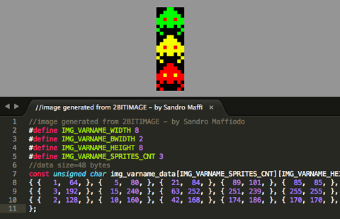

To convert an image to the VGAX format (2bit per pixel) i wrote a simple webapp that reads an image and create a C/C++ source file to be used with VGAX.

The image that you can use as a source must use only the colours that you are generating with your hardware. For example if you use the red and green pins, you must convert your image using another tool so your image should only use these four colors: red, green, yellow and black. 2bitimage packs them in the 2bit format used by VGAX but not perform any color convertion.

The source file of the webapp is inside the tools directory. You can open 2bitimage.html with your webbrowser and run it locally. I use Google Chrome, dunno if works with other webbrowsers.

### 2bitfont

With 2bitfont you can create your fonts from a single image and convert them to be used with VGAX library. The tool reads an image that contains all font's glyphs are separated from a vertical blank line. All glyphs are extracted and converted to a C/C++ source file.

2bitfont is a webapp, like 2bitimage, that can run locally on your webbrowser.
    
## FAQ

- How to center the video signal horizontally? At this time i could not able to center horizontally the signal without loosing some pixels or the audio signal generation. You can calibrate the horizontal offset manually, on your monitor or use your monitor auto calibration, if you have it
- How to center the video signal vertically? You can do it by changing the **RENDERLCOUNT** const inside VGAX.cpp
- How to change the audio pin from **ANALOG0** to another pin? You can change the pin to another analog pin. Modify this line in VGAX.cpp:  

	  pinMode(A0, OUTPUT);
  
  and change **1** to another pin in this asm line, of the same file:
  
      "      ldi r18, 1                       \n\t" //c1
      "      out %[audiopin], r18             \n\t" //c1

  (1 mean A0, 2 mean A1, 4 mean A3, 8 mean A4 and so on)
- How can i prevent screen flickering? At this time there is no one mechanism to prevent the flickering. The right way to prevent flicker is to use a double (frame)buffer but there isn't enought free memory to do that.

## Happy hacking

If you find a way to optimize the speed of the library, or find a way to center horizontally the video signal, or you can improve the quality of the audio signal generated, let me know!

Happy hacking!
